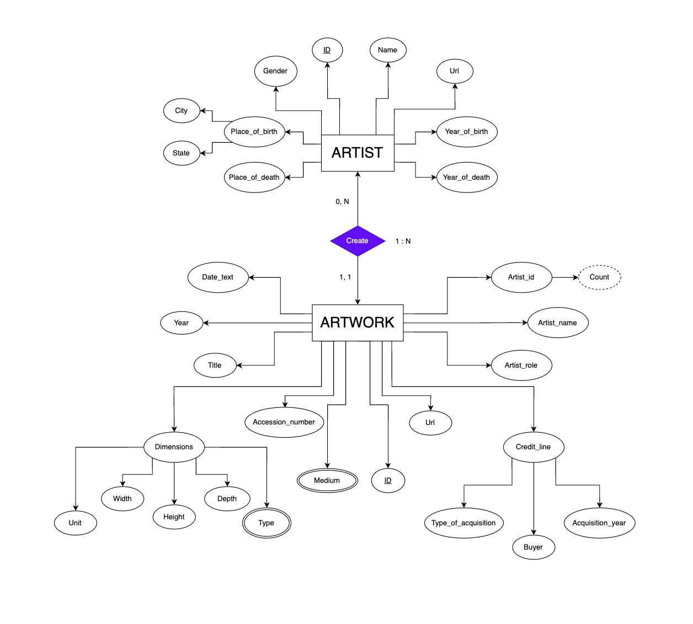

# Databases Course Project

## Introduction
Project for "Basi di Dati" course of Universitá di Ferrara by [Alessio Celentano](https://github.com/alessiocelentano) e [Thomas Cantuti](https://github.com/thomascantuti).
The goal is to develop a simple local web site which interfaces with a database of a gallery using HTML, PHP, Python and MySQL.

## Installation
```zsh
$ git clone https://github.com/Databases-Course-Project/Databases-Course-Project
$ cd Databases-Course-Project
$ python3 -m venv .
$ source bin/activate
$ pip3 install -r requirements.txt
```

## Usage
### Step 1: ER Diagram
- We drew the following ER Diagram for this database


### Step 2: Data Cleaning
- Raw data is stored in two files, `artists_data.csv` and `artworks_data.csv`
- We have to clean these files and we do it using Pandas

### Step 3: MySQL Database Creation
- We can create the database with MySQL Workbench or via the terminal
```zsh
$ mysql -u username -p
mysql> CREATE SCHEMA museo;
mysql> USE museo;
mysql> exit;
```

### Step 4: Create and Initialize the Tables
- We have written a Python script to automatize the reading of every query contained in the `csv`s files and their writing in the database
- Tables creation:
 ```mysql
CREATE TABLE Artists (
    id INTEGER NOT NULL,
    name VARCHAR(255) NOT NULL,
    gender CHAR NOT NULL,
    year_of_birth CHAR(4) NOT NULL,
    year_of_death VARCHAR(4),
    place_of_birth VARCHAR(50),
    place_of_death VARCHAR(50),
    url VARCHAR(255) NOT NULL,

    PRIMARY KEY (id)
)
```
```mysql
CREATE TABLE Artworks (
    id INTEGER NOT NULL,
    accession_number CHAR(6) NOT NULL,
    artist VARCHAR(255),
    artistRole VARCHAR(20),
    artistId INTEGER NOT NULL,
    title VARCHAR(2047),
    dateText VARCHAR(255),
    medium VARCHAR(255),
    creditLine VARCHAR(2047),
    year INTEGER,
    acquisitionYear INTEGER,
    types VARCHAR(100),
    width INTEGER,
    height INTEGER,
    depth INTEGER,
    units CHAR(2),
    inscription CHAR(15),
    url VARCHAR(255),

    PRIMARY KEY (id, accession_number),
    UNIQUE (id),
    FOREIGN KEY (artistId) REFERENCE (id) FROM Artists
)
```
- Entry insert
```mysql
INSERT INTO Artists VALUES (%s, %s, %s, %s, %s, %s, %s, %s)
```
```mysql
INSERT INTO Artworks VALUES (%s, %s, %s, %s, %s, %s, %s, %s, %s, %s, %s, %s, %s, %s, %s, %s, %s, %s)
```

